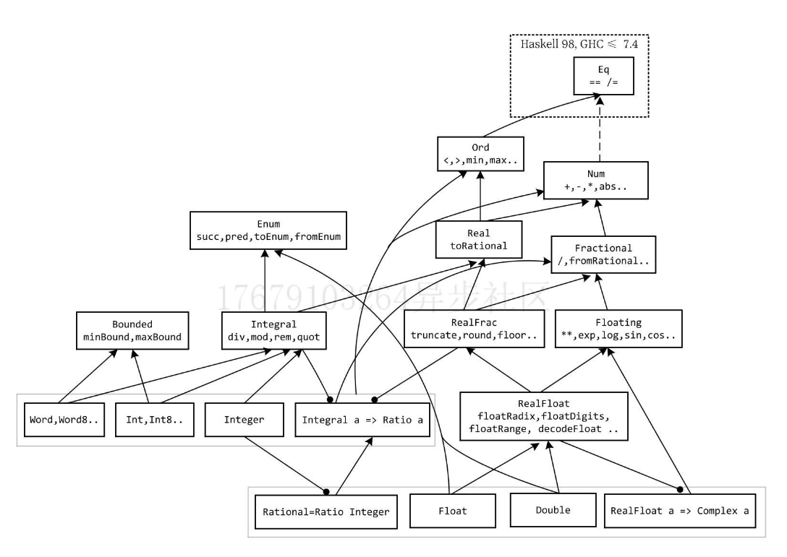

# Haskell函数式编程入门（卷1）


## 类型系统和函数

### 类型

| 类型     | 作用                      |
| -------- | ------------------------- |
| Rational | 有理数（利用分数表示）    |
| Floating | 单精度                    |
| Double   | 双精度                    |
| Int      | 根据机器类型，32/64位整型 |
| Integer  | 无限精度整形              |



### 类型转换函数

| 函数名                | 作用                                             |
| --------------------- | ------------------------------------------------ |
| fromInteger           | 传进来 Integer 转换为 Num 或者 Num 下的任意类型  |
| toInteger             | 传进来Integral，转换为 Integer                   |
| fromRational          | 传进来 Rational，转换为 Real 或者 其下的任意类型 |
| toRational            | 传进来 Real，转换为 Rational                     |
| fromIntegral          | 传进来 Integral，转换为 Num                      |
| truncate              | 取小数的整数部分                                 |
| properFraction        | 小数两部分都取出来，当成元组反出去               |
| floor, ceiling, round | 向下，向上，四舍五入                             |

### 固定精度小数

##### 常用精度

| type  | data      |
| ----- | --------- |
| Uni   | Fixed E0  |
| Deci  | Fixed E1  |
| Centi | Fixed E2  |
| Milli | Fixed E3  |
| Micro | Fixed E6  |
| Nano  | Fixed E9  |
| Pico  | FIxed E12 |

##### NaN 与 无穷大

NaN（Not a Number），不与任何数相等，甚至是自身，利用 isNan 判定

Infinity 分正负，利用 isInfinite 判定


### 科学计数法

:set -XNumDecimals，可以让 GHCi 自动决定，输入的数是用 Num 还是 Fractional


### 函数思想入门

函数因为柯里化的原因，可以不完全应用，即不给所有参数，这时函数会返回一个函数，如

```haskell
(+5)
```

这时候，他的返回值是 (Num a) => (a -> a)


##### 函数的基本定义格式

```haskell
fun_name :: param1Tyep -> param2Type -> ... -> resultType
fun_name param1 param2 ... = fun_body
```


```haskell
add, sub :: Int -> Int -> Int
add a b = a + b
sub a b = a - b

function :: (Show a, Ord a) => a -> a -> a
function2 :: Show a => Ord a => a -> a -> a
```


##### λ 表达式

```haskell
fun_name :: param1Type -> param2Type -> ... -> resultType
fun_name = \param1 -> \param2 -> ... -> fun_body

fun :: (a -> a) -> a -> a
fun = \a -> \b -> a b
```

代码编译后，函数都会转成 λ 表达式

λ 表达式 如果参数依次输入，可以简化

```haskell
f' = \x -> \y -> x y
f' = \x y -> x y
```


1. ###### α 替换

    不出现命名冲突的前提下，将函数的参数重新命名

    $\lambda x \rightarrow \lambda y \rightarrow x + y \equiv _\alpha \lambda a \rightarrow \lambda y \rightarrow a + y$

2. ###### β 化简（β 归约）

    应用参数 N 于函数 λx -> M，相当于在不出现命名冲突的前提下，把 M 中出现的 x 替换为 N

    $(\lambda x \rightarrow M) N \rightarrow _\beta [N/x]M$

    

    (\x -> \y -> x y) (abs) (-5) -> $_\beta$ (\y -> abs y) (-5) -> $_\beta$ （abs (-5)）-> 5

3. ###### η 化简（η 归约）

    定义函数时，可以将一个参数传给函数 M，进行计算的函数和 M 本身是同一个函数

    $(\lambda x \rightarrow M \; x) \rightarrow _\eta M$

    ```haskell
    g, g', g'' :: Int -> Innt -> Int
    g = \y -> \x -> (+) x y
    g' = \x -> (+) x
    g'' = (+)
    ```

###### 作用

1. 构造匿名函数

    ``` haskell
    map (\x -> 2 * x + 7) [1..10]
    ```

2. 对于柯里化函数，在不给定一个参数的前提下，给定后一个

    ``` haskell
    f' :: Num a => a -> a -> a
    f' x y = f*x + 5*y = 1
    -- 想只给 y 赋值
    (\x -> f' x 5)
    ```

    也可使用中缀运算符完成

    ```haskell
    map (^ 3) [1, 2, 3]
    ```

    

### 参数的绑定

三角形的面积公式

$S = \sqrt{p(p-a)(p-b)(p-c)}\;(p=\frac{a+b+c}{2})$

```haskell
s :: Double -> Double -> Double -> Double
s a b c = let p = (a + b + c) / 2
          in sqrt (p * (p-a) * (p-b) * (p-c))
          
-- 绑定函数
a = let f x = x + 1 in f 5

-- 多个表达式绑定可以用分号隔开
b = let x = 2; y = 2; in x + y

-- 还能使用 where
s' :: Double -> Double -> Double
s' a b c = sqrt (p * (p-a) * (p-b) * (p-c))
          where
              p = (a + b + c) / 2
              
-- 注意命名捕获
let x = 6 in x * let x = 2 in x * x

-- where 在整个函数里都有用，但 where 也和 let 一样可以多级
s'' :: Double -> Double -> Double -> Double
s'' a b c = sqrt (p * (p-a) * (p-b) * (p-c))
    where p = (a + b + c) / 2 + fuck
        where fuck = 0
```


### 表达式


#### 条件表达式

```haskell
-- else 不可省略
isTwo :: Int -> Bool
isTwo n = if n == 2 then True then False
```

#### 情形分析表达式

```haskell
month :: Int -> Int
month n = case n of
    1 -> 31
    2 -> 28
    3 -> 31
    4 -> 30
    5 -> 31
    6 -> 30
    7 -> 31
    8 -> 31
    9 -> 30
    10 -> 31
    11 -> 30
    12 -> 31
    _ -> error "invalid month"
```

#### 守卫表达式

```haskell
abs' :: (Num a, Ord a) => a -> a
abs' n
    | n > 0 = n
    | otherwise = -n
```

#### 模式匹配

本质就是 case..of.. 的语法糖

```haskell
month' :: Int -> Int
month' 1 = 31
month' _ = error "invalid month"

-- 列表有两种匹配
head' :: [a] -> a
head' [] = error "empty list"
head' (x:_) = x
```


#### 运算符与自定义运算符

1. 优先级

    0 ~ 9

2. 结合性

    左结合，右结合，无结合

3. 位置

    前缀，中缀，后缀

定义的函数拥有最高的优先级，比 9 高，且为左结合，f g h i 意为 (((f g) h) i)


###### 自定义运算符

``` haskell
-- infixl 左结合，infixr 右结合，infix 无结合

infixr 5 <->, <+>
(<->), (<+>) :: Int -> Int -> Int
(<->) x y = x - y
(<+>) x y = x + y

infixl 5 ++++
(++++) a b = a + b

infix 5 +-
(+-) a b c = a + b - c
```

#### GHCI中定义函数

```haskell
:{
{foo :: Int -> Int
; foo 1 = 2
; foo 2 = 1
; foo n =0 }
:}
```

​	